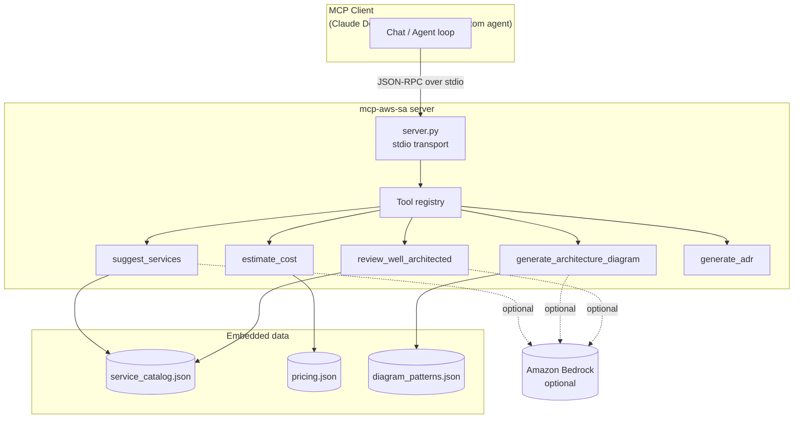

# Architecture

## Overview

`mcp-aws-solution-architect` is a Python MCP server that exposes five tools designed to support a Solution Architect's workflow. It is intentionally small, typed, and dependency-light.



## Key decisions

See `docs/adr/` for the full set. Highlights:

- **[ADR-0002] Use the official `mcp` Python SDK** with FastMCP-style decorators for ergonomics.
- **[ADR-0003] Bedrock is optional**, not a hard dependency, so the server runs anywhere Python runs.
- **Stdio first.** HTTP transport is on the roadmap.

## Module map

```
src/mcp_aws_sa/
├── server.py              # MCP entrypoint, tool registration, main()
├── tools/
│   ├── services.py        # suggest_services
│   ├── architecture.py    # generate_architecture_diagram
│   ├── cost.py            # estimate_cost
│   ├── well_architected.py# review_well_architected
│   └── adr.py             # generate_adr
├── data/
│   ├── service_catalog.py # curated AWS service mapping (use-case → services)
│   ├── pricing.py         # simplified monthly pricing table
│   └── patterns.py        # mermaid templates for common patterns
└── models.py              # shared pydantic types
```

## Data sources

The embedded catalog and pricing table are **deliberately simple and explicit**. They are intended to be:

- transparent (anyone can read them in 30 seconds),
- easy to extend (PRs to add a service or a pricing tier are one-file changes),
- and **clearly labeled as approximations** in tool output.

For exact, live pricing, the roadmap is to wire `estimate_cost` to the **AWS Price List API** when AWS credentials are present.

## Testing strategy

Unit tests cover every tool's behavior with multiple inputs, including edge cases (unknown service, malformed input). The server entrypoint is smoke-tested by spinning it up and exchanging an `initialize` message.

## Extending

Each tool is a single file with a pure-Python function plus a Pydantic input model. Adding a tool is a four-step diff:

1. Add the function + model to a new file in `src/mcp_aws_sa/tools/`.
2. Register it in `src/mcp_aws_sa/server.py`.
3. Write tests in `tests/`.
4. Add a doc page in `docs/tools/`.
