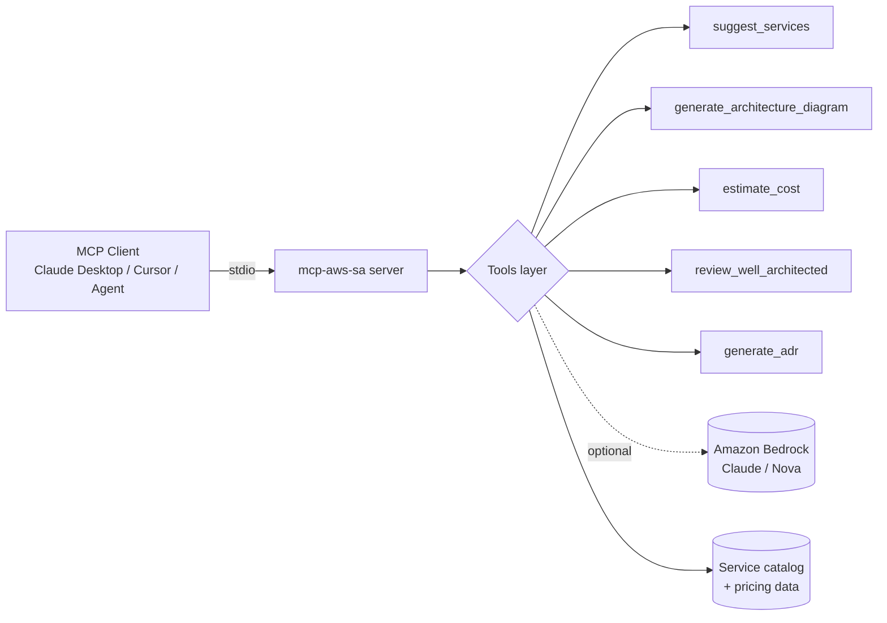

<div align="center">

# mcp-aws-solution-architect

**A Model Context Protocol (MCP) server that turns any MCP-aware client into a copilot for AWS Solution Architects.**

[](https://github.com/fernandofatech/mcp-aws-solution-architect/actions/workflows/ci.yml)
[](https://fernandofatech.github.io/mcp-aws-solution-architect/)
[](https://www.python.org/downloads/)
[](LICENSE)
[](https://modelcontextprotocol.io/)
[](https://www.conventionalcommits.org)

[Docs](https://fernandofatech.github.io/mcp-aws-solution-architect/) ·
[Landing](https://mcp-aws-solution-architect.vercel.app) ·
[Quickstart](#quickstart) ·
[Tools](#tools) ·
[Architecture](ARCHITECTURE.md)

</div>

---

## Live portfolio / Portfolio ao vivo

- **Production:** [MCP AWS Solution Architect](https://mcp-aws.moretes.com)
- **Documentation:** [Project docs](https://fernandofatech.github.io/mcp-aws-solution-architect/)
- **GitHub:** [fernandofatech/mcp-aws-solution-architect](https://github.com/fernandofatech/mcp-aws-solution-architect)
- **Author:** [Fernando Francisco Azevedo](https://fernando.moretes.com) · [LinkedIn](https://www.linkedin.com/in/fernando-francisco-azevedo/) · [GitHub](https://github.com/fernandofatech)

This public repository is part of a bilingual portfolio focused on solution architecture, AWS, AI, MCP/tooling, DevSecOps, and production-ready engineering practices.

Este repositório público faz parte de um portfólio bilíngue focado em arquitetura de soluções, AWS, IA, MCP/tools, DevSecOps e boas práticas de engenharia para produção.

## Why

Solution Architects spend a lot of time on repetitive shaping work: drafting Mermaid diagrams, eyeballing rough monthly cost, sanity-checking a design against the Well-Architected Framework, writing ADRs. This MCP server exposes those tasks as **structured tools** that any MCP-aware assistant (Claude Desktop, Cursor, Cline, Continue, custom agents) can call.

It is **deterministic by default** (no LLM dependency to ship), **extensible** (each tool can be backed by Amazon Bedrock for richer output), and **production-grade** (typed, tested, CI'd).

## Tools

| Tool | What it does |
| --- | --- |
| `suggest_services` | Maps a use case description to a curated list of AWS services with rationale. |
| `generate_architecture_diagram` | Produces a Mermaid diagram for common architecture patterns (web app, RAG, event-driven, batch). |
| `estimate_cost` | Rough monthly cost estimate from a list of `{service, usage}` items, using an embedded pricing table. |
| `review_well_architected` | Lightweight review of an architecture across the six Well-Architected pillars with findings + recommendations. |
| `generate_adr` | Formats an Architecture Decision Record in MADR style from inputs (context, options, decision, consequences). |

Full reference: [docs site](https://fernandofatech.github.io/mcp-aws-solution-architect/tools/suggest-services/).

## Quickstart

### Install (from source)

```bash
git clone git@github.com:fernandofatech/mcp-aws-solution-architect.git
cd mcp-aws-solution-architect
python -m venv .venv && source .venv/bin/activate
pip install -e ".[dev]"
```

### Run the server

```bash
mcp-aws-sa
```

The server uses **stdio transport** (the MCP default) and is ready to be wired into any MCP client.

### Wire into Claude Desktop

Edit `~/Library/Application Support/Claude/claude_desktop_config.json`:

```json
{
  "mcpServers": {
    "aws-solution-architect": {
      "command": "mcp-aws-sa",
      "args": []
    }
  }
}
```

Restart Claude Desktop. The five tools above are now callable from any chat.

### Try it

> "Suggest AWS services for a real-time multiplayer game backend with global players. Then draft a Mermaid diagram and a rough monthly cost for 50k DAU."

The assistant will call `suggest_services` → `generate_architecture_diagram` → `estimate_cost` automatically.

## Architecture

A short read: [ARCHITECTURE.md](ARCHITECTURE.md). High-level:



## Project layout

```
.
├── src/mcp_aws_sa/        # Python package — server + tools + data
├── tests/                  # pytest suite
├── docs/                   # MkDocs Material site (deployed to GitHub Pages)
├── frontend/               # dependency-free static landing (deployed to Vercel)
└── .github/workflows/      # CI, docs deploy
```

## Automation

This portfolio repo ships with automated checks for production-shaped engineering hygiene:

- **Python:** Ruff, mypy, pytest.
- **Frontend:** lint, static build, and `npm audit`.
- **Docs:** strict MkDocs build and GitHub Pages deploy.
- **Security:** CodeQL, pip-audit, dependency review, Trivy filesystem scan, and Gitleaks secret scan.
- **Maintenance:** Dependabot for GitHub Actions, Python dependencies, and frontend dependencies.
- **Vercel:** automatic preview and production deploys are connected through Vercel Git integration.

See [OPERATIONS.md](OPERATIONS.md) for the full workflow and required secrets.

## Development

```bash
# Install dev deps
pip install -e ".[dev]"

# Lint + format
ruff check . && ruff format .

# Type check
mypy src

# Test
pytest -v
```

Conventional Commits are enforced in CI. See [CONTRIBUTING.md](CONTRIBUTING.md).

## Roadmap

- [ ] Optional Bedrock backend (Claude Sonnet / Nova) per tool for richer reasoning
- [ ] Live AWS Pricing API integration for `estimate_cost`
- [ ] Additional architecture patterns (data lake, ML inference, hybrid)
- [ ] HTTP transport (in addition to stdio) for remote MCP servers
- [ ] Export `generate_architecture_diagram` to draw.io and PNG

## Contributing

Issues and PRs welcome. Please read [CONTRIBUTING.md](CONTRIBUTING.md) and follow [Conventional Commits](https://www.conventionalcommits.org).

## License

[MIT](LICENSE) © Fernando Francisco Azevedo

## Author

**Fernando Francisco Azevedo** — Solution Architect, AWS & AI focus.
[fernando@moretes.com](mailto:fernando@moretes.com) · [LinkedIn](https://www.linkedin.com/in/fernando-francisco-azevedo/) · [fernando.moretes.com](https://fernando.moretes.com)
