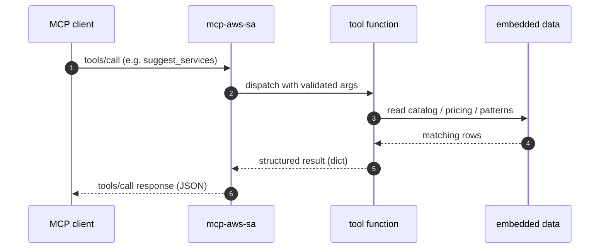

# Architecture

Same content as the repo's [ARCHITECTURE.md](https://github.com/fernandofatech/mcp-aws-solution-architect/blob/main/ARCHITECTURE.md), kept here for the docs site.

## Module map

```
src/mcp_aws_sa/
├── server.py              # MCP entrypoint, tool registration, main()
├── models.py              # shared pydantic types
├── tools/
│   ├── services.py
│   ├── architecture.py
│   ├── cost.py
│   ├── well_architected.py
│   └── adr.py
└── data/
    ├── service_catalog.py
    ├── pricing.py
    └── patterns.py
```

## Sequence (one tool call)



## Design principles

1. **Deterministic by default.** No LLM dependency to ship.
2. **Typed.** Pydantic models for inputs / outputs where it adds value; type-checked with mypy strict.
3. **Small surface.** Each tool is one file with one pure function.
4. **Explicit data.** Catalog, pricing and patterns are Python data, readable in seconds.
5. **Extension points.** Each tool can be backed by Bedrock when AWS creds are present (planned).

## Testing

Unit tests cover every tool's behavior with multiple inputs and edge cases. The server module is smoke-tested by importing and exercising the tool wrappers directly.

Run the suite:

```bash
pytest -v
```
