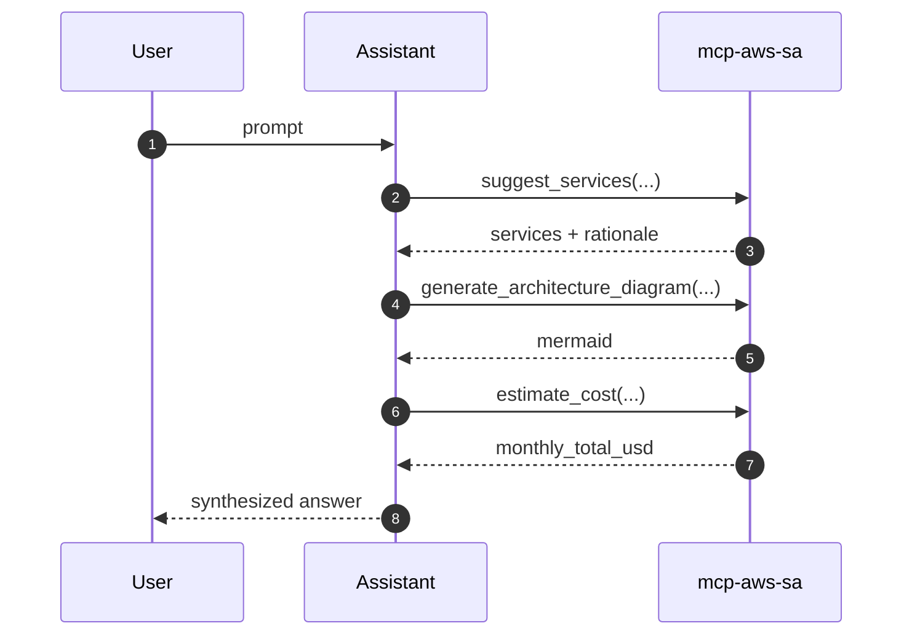

# mcp-aws-solution-architect

> An MCP server that turns any MCP-aware client into a copilot for AWS Solution Architects.

This site is the user-facing reference for `mcp-aws-solution-architect`. The source lives at [github.com/fernandofatech/mcp-aws-solution-architect](https://github.com/fernandofatech/mcp-aws-solution-architect).

## What it does

It exposes five tools over the [Model Context Protocol](https://modelcontextprotocol.io/) that cover the bulk of an SA's day-to-day shaping work:

- :material-tools: **`suggest_services`** — map a use case description to a curated list of AWS services with rationale.
- :material-graph-outline: **`generate_architecture_diagram`** — emit a Mermaid diagram for a named pattern.
- :material-cash: **`estimate_cost`** — rough monthly cost from a list of `{service, usage}` items.
- :material-check-circle-outline: **`review_well_architected`** — lightweight 6-pillar review of an architecture description.
- :material-file-document-edit-outline: **`generate_adr`** — render a MADR-style Architecture Decision Record.

Plus a `server_info` utility and `list_architecture_patterns` discovery helper.

## Quick demo

> *"Suggest AWS services for a real-time multiplayer game backend with global players. Then draft a Mermaid diagram and a rough monthly cost for 50k DAU."*

The assistant will call `suggest_services` → `generate_architecture_diagram` → `estimate_cost` and return a complete answer.

## Where to next

- [Getting started](getting-started.md) — install and wire into Claude Desktop / Cursor.
- [Tools reference](tools/suggest-services.md) — per-tool inputs, outputs and examples.
- [Architecture](architecture.md) — how the server is built.
- [ADRs](adr/0001-record-architecture-decisions.md) — the decisions behind the code.

## Author

Built by **Fernando Francisco Azevedo** — Solution Architect, AWS & AI focus.
[fernando@moretes.com](mailto:fernando@moretes.com) · [LinkedIn](https://www.linkedin.com/in/fernando-francisco-azevedo/) · [fernando.moretes.com](https://fernando.moretes.com)
