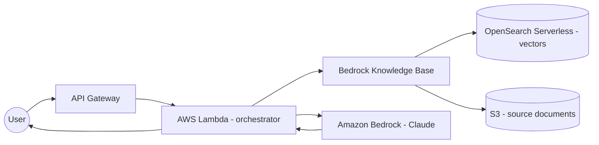

# `generate_architecture_diagram`

Return a Mermaid diagram for a named architecture pattern.

## Signature

```python
generate_architecture_diagram(pattern: str, title: str | None = None) -> dict
```

## Discover patterns

```python
list_architecture_patterns() -> list[dict]
```

Returns the available keys and their canonical titles.

## Patterns

| Key | Title |
| --- | --- |
| `web-app` | Three-tier web app |
| `rag` | RAG with Bedrock + OpenSearch |
| `event-driven` | Event-driven processing |
| `batch-etl` | Batch ETL pipeline |
| `agent` | Agentic system with Bedrock Agents |
| `streaming` | Streaming ingestion + analytics |

## Example

Request: `generate_architecture_diagram("rag")`



Unknown patterns return a structured error with the list of valid keys:

```json
{
  "error": "Unknown pattern 'foo'.",
  "available_patterns": [
    { "key": "web-app", "title": "Three-tier web app" },
    ...
  ]
}
```
